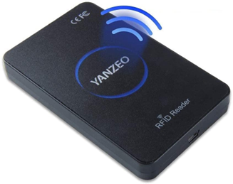
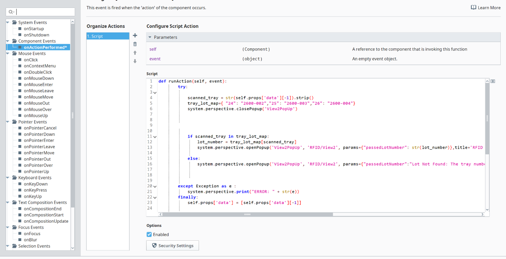
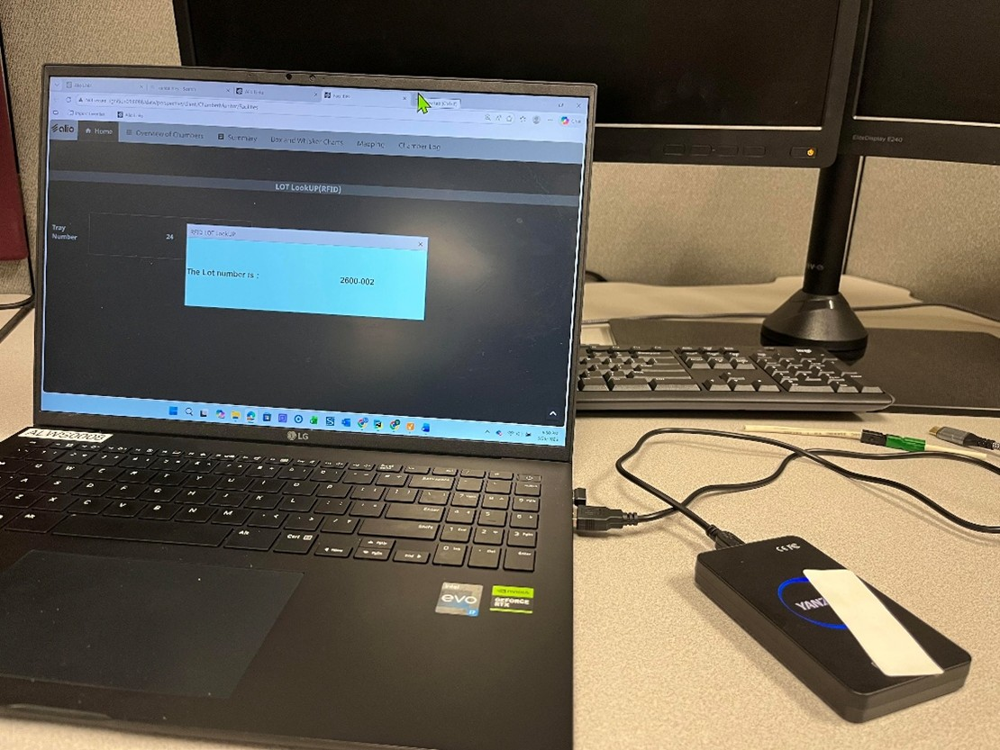
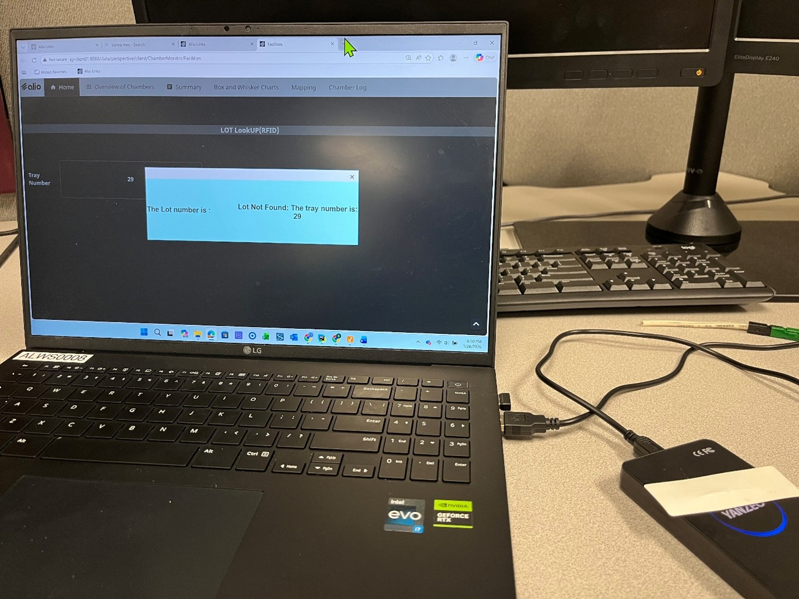

# rfid-tray-tracking-system
RFID-based tray tracking system using UHF RFID tags, reader/writer, and Ignition Perspective for tray-to-lot lookup.

## Overview
During my automation internship, I developed an RFID-based tray tracking system to identify trays and retrieve their corresponding lot numbers using UHF RFID technology and Ignition Perspective.

The system uses RFID sticker tags attached to trays, a Yanzeo SR360 UHF RFID reader/writer for reading and writing tag values, and an Ignition-based interface to validate scanned tray IDs and display the associated lot number. The solution was designed for future integration with the Kanoa MES system.

## Problem
The facility needed a simple and reliable way to identify trays and determine the correct lot number without depending on manual lookup or operator memory. The goal was to reduce tracking errors and make tray identification faster and more consistent for production use.

## My Contribution
During my internship, I designed and implemented the RFID tray tracking workflow using RFID hardware and Ignition Perspective.

### System Design & Implementation
- Built an RFID-based tray identification workflow using **UHF RFID sticker tags**
- Used a **Yanzeo SR360 UHF RFID reader/writer** to read and write tray tag values
- Developed the user-facing interface in **Ignition Perspective**
- Designed the workflow so scanned tray IDs could be matched with lot numbers for future **Kanoa MES** integration

### RFID Tag Setup
- Configured the RFID reader/writer for tag reading and writing
- Wrote tray identification numbers onto rewritable UHF RFID tags
- Verified scan behavior using keyboard emulation mode

### Ignition Logic
- Captured scanned RFID values using the **Barcode Scanner Input** component in Ignition Perspective
- Processed scanned tray values inside the `onActionPerformed` event
- Mapped tray numbers to lot numbers using Python dictionary-based logic
- Displayed the lot number in a popup when a valid tray was scanned
- Displayed a "Lot Not Found" message when no tray match existed

### Scan Cleanup & Validation
- Used regex configuration to clean scanner input
- Removed leading zeros and trailing newline / enter characters from scanned data
- Ensured only the latest scanned value was processed and retained

  ## System Workflow

1. A tray is assigned a unique RFID tag value.
2. The tag is written using the UHF RFID reader/writer.
3. The RFID-tagged tray is scanned by the operator.
4. Ignition Perspective captures the scanned value.
5. The system checks the scanned tray ID against the tray-to-lot mapping.
6. If a match is found, the associated lot number is displayed.
7. If no match is found, the system displays a "Lot Not Found" message.

## Hardware and Software Used

### Hardware
- Yanzeo SR360 UHF RFID Reader/Writer
- UHF RFID sticker tags
- USB connection for power and communication

### Software / Platform
- Ignition Perspective
- Ignition Designer
- Python scripting inside Ignition
- RFID configuration software for writing tags

## Skills Demonstrated

- Industrial Automation
- RFID System Integration
- Ignition Perspective Development
- Python Scripting in SCADA
- Human-Machine Interface Design
- Scan Data Validation and Cleanup
- Troubleshooting Hardware/Software Integration
- MES-oriented Workflow Design
## System Visualization

### RFID Reader / Writer Setup

### Ignition Perspective on Actionperformed script

### Test Case - Lot Found

### Test Case - Lot Not Found

